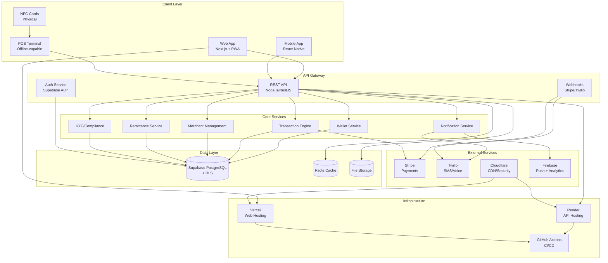
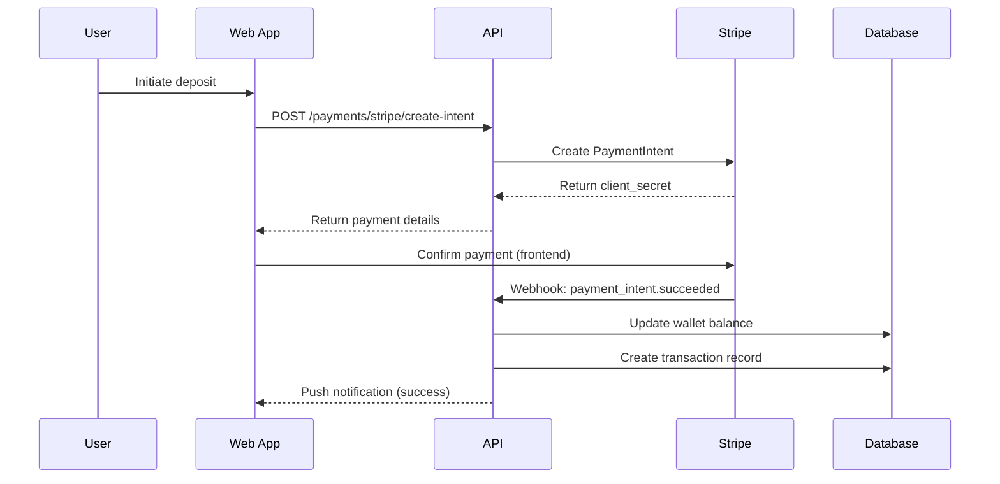
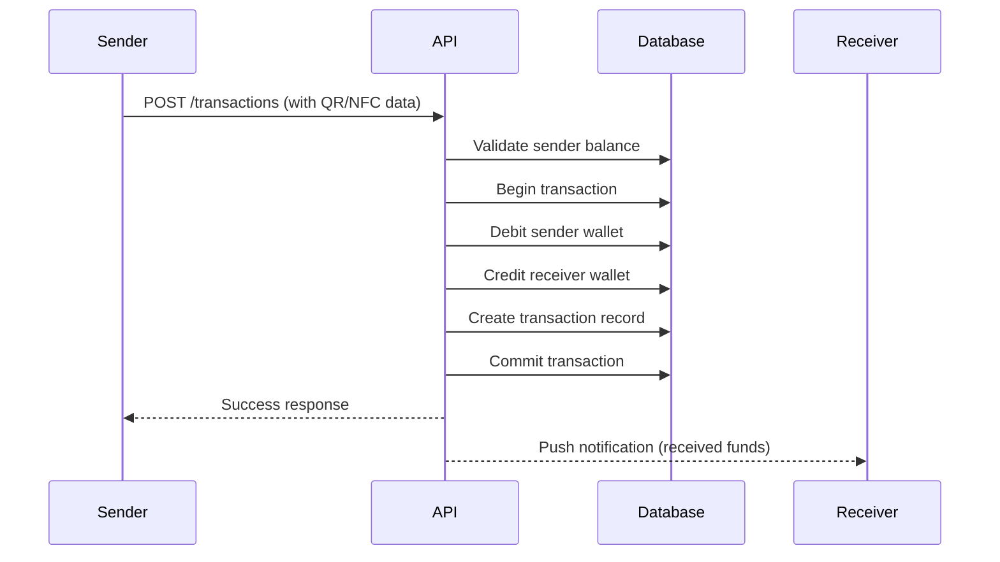
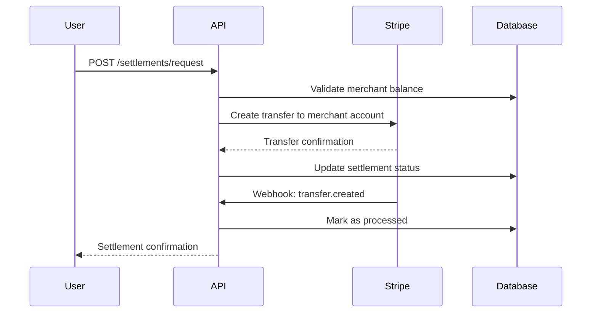
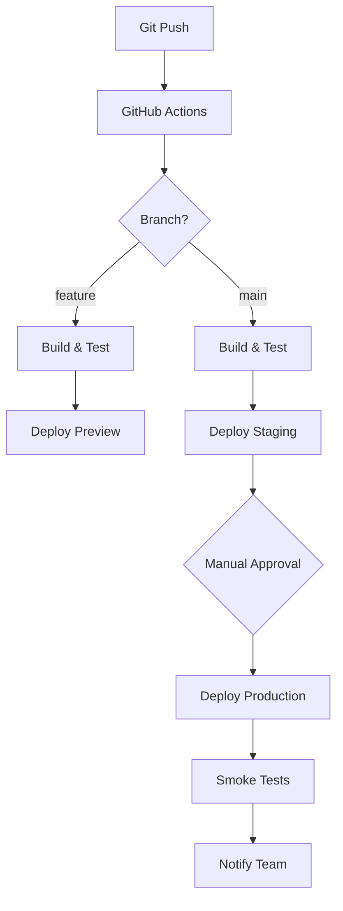

# KobKlein Architecture Documentation

**Version:** 2.0  
**Last Updated:** November 1, 2025  
**Author:** GitHub Copilot (Senior Full-Stack Engineer)  
**Authority:** `/docs/AUTHORIZATION.md`

## System Overview

KobKlein is a cashless, borderless, community-owned payments platform designed for Haiti and the diaspora. The system enables secure peer-to-peer transfers, merchant payments, NFC card management, and cross-border remittances.

## High-Level Architecture



## Technology Stack

### Frontend
- **Framework:** Next.js 14 (App Router)
- **Language:** TypeScript
- **Styling:** Tailwind CSS + shadcn/ui
- **PWA:** Service Worker + IndexedDB for offline POS
- **i18n:** English, French, Haitian Creole, Spanish
- **State:** React Query + Zustand
- **Mobile:** React Native with Expo

### Backend
- **Runtime:** Node.js 20+
- **Framework:** NestJS with Express
- **Language:** TypeScript
- **API Style:** REST (with optional tRPC)
- **Validation:** Zod + class-validator
- **Authentication:** Supabase Auth
- **Documentation:** OpenAPI/Swagger

### Database & Storage
- **Primary:** Supabase PostgreSQL with Row Level Security
- **Cache:** Redis (managed by Render/Upstash)
- **Files:** S3-compatible storage (Supabase Storage)
- **Search:** PostgreSQL full-text search
- **Migrations:** Supabase CLI

### External Services
- **Payments:** Stripe (cards, ACH, international)
- **Communications:** Twilio (SMS, Voice verification)
- **CDN/Security:** Cloudflare (DNS, DDoS, caching)
- **Analytics/Push:** Firebase (limited scope)
- **Monitoring:** Sentry + Uptime monitoring

### Infrastructure & Deployment
- **Web Hosting:** Vercel (auto-deploy from main)
- **API Hosting:** Render (containerized deployment)
- **CI/CD:** GitHub Actions with environment protection
- **DNS:** Cloudflare
- **Package Manager:** pnpm 9.x

## Data Architecture

### Core Entities

```mermaid
erDiagram
    User {
        uuid id PK
        string email UK
        string phone UK
        string firstName
        string lastName
        enum status
        enum kycStatus
        timestamp createdAt
        timestamp updatedAt
    }
    
    UserRole {
        uuid id PK
        uuid userId FK
        enum role
        timestamp assignedAt
    }
    
    Wallet {
        uuid id PK
        uuid userId FK
        string currency
        decimal balance
        decimal frozenBalance
        enum status
        timestamp createdAt
    }
    
    Card {
        uuid id PK
        uuid userId FK
        string nfcUid UK
        enum status
        timestamp issuedAt
        timestamp activatedAt
    }
    
    Merchant {
        uuid id PK
        uuid ownerUserId FK
        string businessName
        string category
        string taxId
        json settlementAccount
        enum status
        timestamp createdAt
    }
    
    Transaction {
        uuid id PK
        uuid fromWalletId FK
        uuid toWalletId FK
        decimal amount
        string currency
        enum type
        enum status
        string reference UK
        json metadata
        timestamp createdAt
        timestamp processedAt
    }
    
    Settlement {
        uuid id PK
        uuid merchantId FK
        decimal amount
        enum status
        string payoutRef
        timestamp createdAt
        timestamp paidAt
    }
    
    Remittance {
        uuid id PK
        uuid diasporaUserId FK
        uuid recipientUserId FK
        decimal amount
        decimal fxRate
        decimal fees
        enum status
        timestamp createdAt
        timestamp deliveredAt
    }
    
    AuditLog {
        uuid id PK
        uuid actorUserId FK
        string action
        string entity
        uuid entityId
        json diff
        inet ipAddress
        timestamp createdAt
    }
    
    User ||--o{ UserRole : has
    User ||--o{ Wallet : owns
    User ||--o{ Card : has
    User ||--o{ Merchant : owns
    Wallet ||--o{ Transaction : from
    Wallet ||--o{ Transaction : to
    Merchant ||--o{ Settlement : receives
    User ||--o{ Remittance : sends
    User ||--o{ Remittance : receives
    User ||--o{ AuditLog : performs
```

### Row Level Security (RLS) Policies

```sql
-- Users can only see their own profile
CREATE POLICY user_own_profile ON users
    FOR ALL USING (auth.uid() = id);

-- Users can only access their own wallets
CREATE POLICY user_own_wallets ON wallets
    FOR ALL USING (auth.uid() = user_id);

-- Users can see transactions where they are sender or receiver
CREATE POLICY user_own_transactions ON transactions
    FOR SELECT USING (
        auth.uid() IN (
            SELECT user_id FROM wallets 
            WHERE id IN (from_wallet_id, to_wallet_id)
        )
    );

-- Merchants can manage their own business
CREATE POLICY merchant_own_business ON merchants
    FOR ALL USING (auth.uid() = owner_user_id);

-- Role-based access for admin functions
CREATE POLICY admin_user_management ON users
    FOR ALL USING (
        EXISTS (
            SELECT 1 FROM user_roles 
            WHERE user_id = auth.uid() 
            AND role IN ('admin', 'super_admin')
        )
    );
```

## Security Architecture

### Authentication Flow
1. User provides email/phone + OTP via Supabase Auth
2. Server validates session and extracts user claims
3. Role-based permissions enforced via RLS and API guards
4. JWT tokens handled transparently by Supabase SDK

### Authorization Layers
1. **Network:** Cloudflare security rules
2. **API:** Rate limiting + request validation
3. **Database:** Row Level Security policies
4. **Application:** Role-based access control (RBAC)

### Data Protection
- All PII encrypted at rest (PostgreSQL encryption)
- Sensitive fields hashed (passwords, PINs)
- Audit trail for all financial operations
- GDPR-compliant data retention policies

## API Architecture

### REST Endpoints Structure

```
/api/v1/
├── auth/
│   ├── POST /signup
│   ├── POST /signin
│   ├── POST /verify-otp
│   ├── POST /refresh
│   └── GET  /me
├── wallets/
│   ├── GET    /my
│   ├── POST   /credit
│   ├── POST   /debit
│   └── POST   /transfer
├── transactions/
│   ├── GET    /
│   ├── POST   /
│   ├── GET    /:id
│   └── PATCH  /:id/status
├── merchants/
│   ├── GET    /my
│   ├── POST   /
│   ├── PATCH  /:id
│   └── GET    /:id/settlements
├── payments/
│   ├── POST   /stripe/create-intent
│   ├── POST   /stripe/confirm
│   └── POST   /webhooks/stripe
├── cards/
│   ├── GET    /my
│   ├── POST   /activate
│   └── PATCH  /:id/status
├── remittances/
│   ├── GET    /
│   ├── POST   /send
│   └── GET    /:id/track
└── admin/
    ├── GET    /users
    ├── POST   /users/:id/roles
    └── GET    /system/health
```

### Webhook Handlers

```
/webhooks/
├── stripe/
│   ├── payment_intent.succeeded
│   ├── transfer.created
│   └── payout.paid
└── twilio/
    ├── message.delivered
    └── call.completed
```

## Payment Flow Architecture

### On-Ramp (Card → Wallet)


### P2P Transfer (Wallet → Wallet)


### Off-Ramp (Wallet → Bank)


## Deployment Architecture

### Environment Strategy
- **Development:** Local with Docker Compose
- **Preview:** Ephemeral environments per PR (Vercel + Render)
- **Staging:** Persistent environment with production-like data
- **Production:** Fully managed with backup/monitoring

### Infrastructure as Code
```yaml
# render.yaml (API deployment)
services:
  - type: web
    name: kobklein-api
    env: node
    buildCommand: pnpm install && pnpm build
    startCommand: pnpm start:prod
    envVars:
      - key: NODE_ENV
        value: production
      - key: DATABASE_URL
        fromDatabase:
          name: kobklein-db
          property: connectionString
```

### CI/CD Pipeline


## Performance Architecture

### Caching Strategy
- **Static Assets:** Cloudflare CDN (1 year)
- **API Responses:** Redis (5-60 minutes)
- **Database Queries:** Connection pooling + query optimization
- **Client:** React Query with stale-while-revalidate

### Monitoring & Observability
- **Application:** Sentry error tracking
- **Infrastructure:** Render metrics + Uptime monitoring
- **Business:** Custom dashboard with KPIs
- **Logs:** Centralized logging with structured format

## Scalability Considerations

### Horizontal Scaling
- API: Stateless containers (easy to scale on Render)
- Database: Supabase handles automatic scaling
- Storage: Supabase Storage with CDN

### Performance Optimization
- Database indexing strategy
- Connection pooling
- Background job processing
- Efficient query patterns

### Cost Optimization
- Resource right-sizing
- Efficient database queries
- CDN usage optimization
- Auto-scaling policies

## Security & Compliance

### Data Classification
- **Public:** Product catalogs, general information
- **Internal:** Business metrics, system logs
- **Confidential:** User profiles, transaction history
- **Restricted:** Payment details, authentication data

### Compliance Framework
- **PCI DSS:** Payment card data security
- **GDPR:** European user data protection
- **SOC 2:** Security and availability controls
- **Local:** Haitian financial regulations

### Incident Response
- Automated alerting for security events
- Runbook for common scenarios
- Escalation procedures
- Post-incident review process

---

## Implementation Roadmap

### Phase 1: Foundation (PRs #1-#4)
- Repository audit and cleanup
- Environment configuration
- Database schema with RLS
- Authentication unification

### Phase 2: Core Features (PRs #5-#8)
- API implementation
- Payment integration
- NFC/QR functionality
- Role-based dashboards

### Phase 3: Enhancement (PRs #9-#11)
- Offline PWA capabilities
- Security hardening
- Internationalization

### Phase 4: Production (PRs #12-#13)
- CI/CD pipeline
- Monitoring & documentation
- Performance optimization

---

**Next Steps:**
1. Review and validate architecture decisions
2. Begin implementation following PR sequence
3. Establish monitoring and feedback loops
4. Regular architecture review sessions