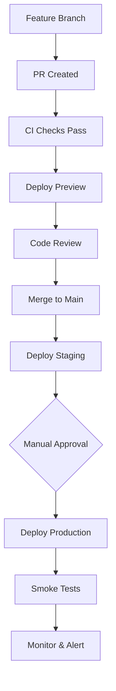

# KobKlein Rules of Engagement (ROE)

**Effective Date:** November 1, 2025  
**Authority:** `/docs/AUTHORIZATION.md`  
**Version:** 1.0

## 1. PR Protocol

### PR Requirements
Each PR must target one numbered milestone (PR #1 Audit, #2 Env, etc.) and include:

**Required Sections:**
- **Summary:** Clear description of what changed and why
- **Risk Assessment:** Potential impacts and mitigation strategies  
- **Migration Plan:** Database changes, data backfill requirements
- **Rollback Steps:** Exact procedure to revert if needed
- **Tests Changed/Added:** Unit, integration, e2e coverage
- **Screenshots:** For any UI changes

**PR Template Structure:**
```markdown
## Summary
- Brief description of changes
- Business justification
- Link to related issues

## Migration Plan  
- [ ] DB migrations required? (yes/no)
- [ ] Data backfill needed? (yes/no)
- [ ] Configuration changes? (yes/no)
- Rollback steps: [detailed procedure]

## Security Review
- [ ] RLS policies impacted? (tests updated)
- [ ] New secrets/permissions? (list them)
- [ ] Authentication flow changes? (describe)

## Testing
- [ ] Unit tests updated/added
- [ ] Integration tests cover new features  
- [ ] E2E tests for critical paths
- [ ] Manual testing checklist completed

## Screenshots
- Before/after for UI changes
- Test results for API changes
```

### Approval Process
- **All PRs:** Require CI green + code review
- **Preview Environment:** Auto-deploy for testing
- **Staging:** Manual approval by owner + smoke tests
- **Production:** Owner approval + green CI + environment checks

### Linking & Tracking
- Link PRs to issues in GitHub Project board
- Update `/docs/CHECKLIST.md` progress
- Reference architecture decisions in `/docs/ARCHITECTURE.md`

## 2. Security Requirements

### Mandatory Security Checks
Every PR must verify:

**Row Level Security (RLS):**
- [ ] New tables have RLS policies
- [ ] Existing policies updated if data model changes
- [ ] SQL tests validate policy enforcement
- [ ] No data leakage between user roles

**API Security:**
- [ ] Zod validation on all inputs
- [ ] Rate limiting on auth and payment endpoints
- [ ] Proper error handling (no info leakage)
- [ ] Authentication/authorization guards in place

**Frontend Security:**
- [ ] No sensitive data in client bundles
- [ ] CSP headers properly configured  
- [ ] XSS prevention measures active
- [ ] HTTPS enforced in production

**Secrets Management:**
- [ ] No secrets in code or PR descriptions
- [ ] Environment-specific secret configuration
- [ ] Secrets rotation capability documented
- [ ] Access logging for secret usage

### Security Documentation
Update `/docs/SECURITY.md` for:
- New authentication flows
- Changed authorization rules
- Additional external service integrations
- Modified data access patterns

## 3. Data & Migration Management

### Database Change Protocol
**All schema changes MUST use migration files:**

```sql
-- Migration: 20251101_add_user_roles_table.sql
-- Description: Add role-based access control
-- Author: GitHub Copilot
-- Rollback: 20251101_rollback_user_roles_table.sql

BEGIN;

CREATE TABLE user_roles (
    id UUID PRIMARY KEY DEFAULT gen_random_uuid(),
    user_id UUID REFERENCES users(id) ON DELETE CASCADE,
    role TEXT NOT NULL CHECK (role IN ('client', 'merchant', 'diaspora', 'distributor', 'admin', 'super_admin')),
    assigned_at TIMESTAMP WITH TIME ZONE DEFAULT NOW(),
    assigned_by UUID REFERENCES users(id),
    UNIQUE(user_id, role)
);

-- Enable RLS
ALTER TABLE user_roles ENABLE ROW LEVEL SECURITY;

-- RLS Policy: Users can see their own roles
CREATE POLICY user_own_roles ON user_roles
    FOR SELECT USING (auth.uid() = user_id);

-- RLS Policy: Only admins can assign roles
CREATE POLICY admin_assign_roles ON user_roles
    FOR INSERT WITH CHECK (
        EXISTS (
            SELECT 1 FROM user_roles 
            WHERE user_id = auth.uid() 
            AND role IN ('admin', 'super_admin')
        )
    );

COMMIT;
```

**Rollback Script (required):**
```sql
-- Rollback: 20251101_rollback_user_roles_table.sql
BEGIN;
DROP TABLE IF EXISTS user_roles CASCADE;
COMMIT;
```

### Seed Data Requirements
Provide `supabase/seed.sql` with:
- **Realistic but sanitized data** (no real PII)
- **All user roles represented**
- **Test transaction scenarios**
- **Reference data (countries, currencies, etc.)**

Example seed structure:
```sql
-- Super admin user (for system access)
INSERT INTO users (id, email, first_name, last_name, role) 
VALUES ('00000000-0000-0000-0000-000000000001', 'admin@techklein.com', 'System', 'Admin', 'super_admin');

-- Test merchant for development
INSERT INTO merchants (id, owner_user_id, business_name, category) 
VALUES ('00000000-0000-0000-0000-000000000002', '00000000-0000-0000-0000-000000000001', 'Test Store', 'retail');
```

### Data Protection Rules
- **No production data in dev/staging**
- **Anonymize all test data**
- **GDPR compliance for EU users**
- **Audit trail for all data changes**

## 4. Deployment Gates

### Environment Progression


### Preview Environment
- **Auto-deploy:** Every PR gets ephemeral environment
- **Purpose:** Manual testing, stakeholder review
- **Lifetime:** Destroyed when PR closed
- **Data:** Synthetic test data only

### Staging Environment
- **Trigger:** Manual approval after merge to main
- **Purpose:** Final validation before production
- **Requirements:** Smoke tests must pass
- **Data:** Production-like but anonymized

### Production Environment  
- **Trigger:** Manual approval by owner only
- **Requirements:**
  - [ ] CI green for at least 24 hours
  - [ ] Staging smoke tests passed
  - [ ] Security review completed
  - [ ] Rollback plan verified
  - [ ] Change window documented
- **Monitoring:** Immediate alerting on errors

### Smoke Test Suite
**Critical Path Validation:**
```javascript
// Example smoke tests
describe('Production Smoke Tests', () => {
  test('Health endpoint responds', async () => {
    const response = await fetch('/api/health');
    expect(response.status).toBe(200);
  });
  
  test('Authentication flow works', async () => {
    // Test login with test user
  });
  
  test('Payment endpoint accessible', async () => {
    // Verify Stripe connectivity
  });
});
```

## 5. Code Quality Standards

### TypeScript Requirements
- **Strict mode enabled:** No `any` types without justification
- **Complete type coverage:** All API responses typed
- **Error handling:** Proper error types and handling
- **Testing:** Types should be testable

### Code Style
- **ESLint:** Must pass with zero warnings
- **Prettier:** Consistent formatting across codebase  
- **Import organization:** Absolute imports, grouped logically
- **Naming conventions:** Clear, descriptive names

### Documentation Standards
- **API endpoints:** OpenAPI/Swagger documentation
- **Complex functions:** JSDoc comments with examples
- **Business logic:** Inline comments explaining why
- **Architecture decisions:** Update `/docs/ARCHITECTURE.md`

## 6. Testing Requirements

### Test Coverage Expectations
- **Unit Tests:** Core business logic (>90% coverage)
- **Integration Tests:** API endpoints and database operations
- **E2E Tests:** Critical user flows (auth, payments, transfers)
- **RLS Tests:** Database security policy validation

### Testing Strategy
```typescript
// Example test structure
describe('WalletService', () => {
  describe('transfer', () => {
    it('should transfer funds between wallets', async () => {
      // Arrange: Setup test wallets
      // Act: Execute transfer
      // Assert: Verify balance changes and transaction record
    });
    
    it('should reject transfer with insufficient balance', async () => {
      // Test error conditions
    });
  });
});
```

### Test Data Management
- **Factories:** Use factories for test object creation
- **Isolation:** Each test should be independent
- **Cleanup:** Proper teardown after tests
- **Realistic scenarios:** Test with production-like data volumes

## 7. Performance Requirements

### Performance Budgets
- **Page Load:** < 3 seconds on 3G connection
- **API Response:** < 500ms for 95th percentile
- **Database Queries:** < 100ms average
- **Bundle Size:** < 500KB for critical path

### Monitoring Requirements
- **Error Rate:** < 0.1% for critical endpoints
- **Availability:** > 99.9% uptime
- **Response Time:** Monitor and alert on degradation
- **Business Metrics:** Track payment success rates

## 8. Communication Protocols

### Change Communication
**High-Impact Changes (require advance notice):**
- Database schema changes
- Authentication flow modifications  
- Payment processing updates
- Breaking API changes

**Communication Channels:**
- **PR Comments:** Technical discussion
- **GitHub Issues:** Feature planning and bug tracking
- **Email:** admin@techklein.com for urgent issues
- **Documentation:** All decisions documented in `/docs/`

### Incident Response
**Severity Levels:**
- **P0:** Production down, payment processing broken
- **P1:** Major feature not working, security issue
- **P2:** Minor bug, performance degradation
- **P3:** Enhancement, non-urgent fix

**Response Times:**
- **P0:** Immediate response, fix within 2 hours
- **P1:** Response within 4 hours, fix within 24 hours  
- **P2:** Response within 24 hours, fix within 1 week
- **P3:** Response within 1 week, fix as capacity allows

## 9. Compliance & Audit

### Audit Trail Requirements
All sensitive operations must be logged:
```typescript
// Example audit log entry
{
  actorUserId: 'uuid',
  action: 'wallet.transfer', 
  entityType: 'transaction',
  entityId: 'uuid',
  changes: { amount: 100, fromWallet: 'A', toWallet: 'B' },
  ipAddress: '192.168.1.1',
  userAgent: 'Mozilla/5.0...',
  timestamp: '2025-11-01T10:00:00Z'
}
```

### Compliance Checklist
- [ ] **PCI DSS:** Payment card data security
- [ ] **GDPR:** European user data protection  
- [ ] **SOC 2:** Security and availability controls
- [ ] **Local Regulations:** Haitian financial compliance

### Regular Audits
- **Security Audit:** Monthly automated scans
- **Code Review:** Every PR requires review
- **Access Review:** Quarterly permission audit
- **Compliance Check:** Annual third-party audit

---

## Enforcement

These rules are enforced through:
- **Automated CI/CD checks**
- **Required approvals in GitHub**
- **Code review process**
- **Environment protection rules**

**Violations will result in:**
- PR rejection until compliance
- Additional review requirements  
- Process improvement discussions

---

**Authority:** As granted in `/docs/AUTHORIZATION.md`  
**Contact:** admin@techklein.com  
**Last Updated:** November 1, 2025